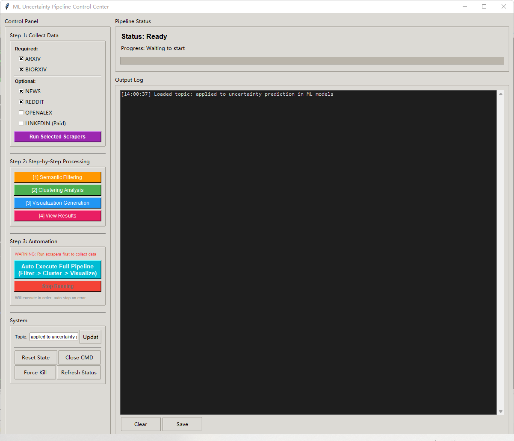

# AAI6610_Fall2025
course project at Northeastern University in AAI 6610, Fall2025

To run this project:

1) Install the dependencies:
```bash
pip install -r requirements.txt

```
2) Change the file name from .env.example to .env and replace all variables with its keys respectively.Run the primary script (gui.py).
```bash
python ./main_control/gui.py

```
3) You will see a Graphical User Interface.



- Select the crawler scripts and click on Selected Scrappers Button
 
- After collecting the data, it can be executed in steps (step two) or directly in one click (step three).
 

4) The files crawled by the crawler will be stored in "scrapers\outputs".

Semantic filtering is located in clustering\outputs\filter_stats_all_sources and clustering\outputs\filtered_posts_all_sources.
The clustering text results will be located in clustering\outputs\cluster_output, the pattern of txt is like:

======================================================================
Cluster 7 — Gaussian Processes and Uncertainty in Dynamics
======================================================================
Representative File: [arxiv-papers]_2312.07387v2.txt

Cluster Summary:
This cluster contains research on Gaussian Processes and their applications to modeling dynamics and control.
The focus is on probabilistic modeling, kernel methods, and approaches to quantify uncertainty in neural systems.

Keywords:
process, gaussian, kernel, neural, dynamics, uncertainty, modeling

Abstract Preview:
Gaussian Processes (GPs) are a versatile method that enables...
[And so on...]

clustering\outputs\cluster_output\HDBSCAN_representatives.txt.
## Group 3: Fetch + Clustering
### Quick start
python3 multisearchfinal.py
# Follow prompts:
#  - Topics: machine learning antibody; drug discovery
#  - SerpAPI key: <optional, press Enter to skip LinkedIn>
#  - Clustering: 1 (K-Means), auto clusters: Y
Outputs go to ./clustered_research_YYYYMMDD_HHMMSS/

